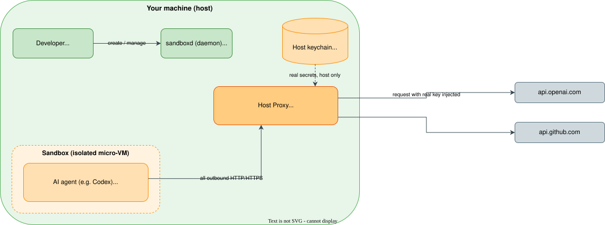
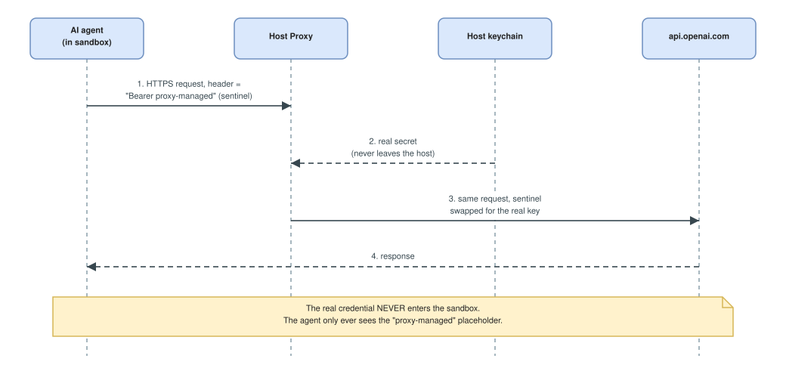

# What is `sbx`? A quick introduction

## What it is

**Docker Sandboxes (`sbx`)** is a tool that runs AI coding agents — Codex, Claude, Gemini, Copilot, Cursor, and others — inside **isolated, policy-controlled environments** (a micro-VM / container) instead of directly on your machine. You keep driving the agent as usual, but it works in a disposable box that only sees what you explicitly hand it.

## Why it was created

As we saw in [`00-01.container-escape.md`](./00-01.container-escape.md), giving a tool — or an autonomous agent — raw access to your host is dangerous: *if you can do it manually, chances are your agent can do it too*. `sbx` was built to solve two problems:

- **Contain the blast radius.** Run coding agents in an isolated environment so they can install packages, run code, and edit files **without messing up your host**. Only the workspaces you mount are visible; the rest of your machine (`~/.ssh`, `~/.aws`, your home directory, other projects) stays invisible.
- **Give agents a safe place to execute code.** Expose an API that agents themselves can call to create sandboxes and run code in isolation from the rest of the system (think "e2b sandboxes, but on your own host").

On top of isolation, `sbx` adds **network policies** (allow/deny which domains a sandbox can reach) and **secret-safe credential handling** (below), so an agent can authenticate to real services without ever holding your secrets in clear text.

## The moving parts

Three components make it work:

- **`sbx` CLI** — what you type (`sbx run codex`, `sbx ports …`, `sbx policy …`); also the dashboard.
- **`sandboxd` (daemon)** — manages the sandbox lifecycle, exposes the Sandbox API, and **hosts the Host Proxy**. It bundles the `sandboxlib` library and auto-starts when needed.
- **The sandbox** — the isolated micro-VM/container where the agent actually runs.

<!-- Mermaid source kept for reference — the rendered diagram is the
     .drawio.svg below. Arrows are written "--&gt;" so they do not
     close this HTML comment.
```mermaid
flowchart LR
    dev["Developer<br/>(sbx CLI / dashboard)"] --&gt;|create / manage| daemon["sandboxd (daemon)<br/>+ sandboxlib"]
    subgraph host["Your machine (host)"]
        dev
        daemon
        keychain[("Host keychain<br/>real credentials")]
        proxy["Host Proxy<br/>network policy + credential injection<br/>(MITM CA for HTTPS)"]
        subgraph vm["Sandbox (isolated micro-VM)"]
            agent["AI agent (e.g. Codex)<br/>sees only placeholders<br/>OPENAI_API_KEY = proxy-managed"]
        end
        keychain -. real secrets, host only .-> proxy
        agent --&gt;|all outbound HTTP/HTTPS| proxy
    end
    proxy --&gt;|request with real key injected| openai["api.openai.com"]
    proxy --&gt; github["api.github.com"]
```
-->



> 🖉 Editable source: [`.assets/00-02-sbx-architecture.drawio.svg`](./.assets/00-02-sbx-architecture.drawio.svg) — open at <https://app.diagrams.net>.

## Security architecture: the proxy + credential injection

This is the part that makes `sbx` safe to use with real credentials.

**Every outbound HTTP/HTTPS request from a sandbox goes through the Host Proxy** (it uses a MITM CA so it can inspect HTTPS). The proxy does two jobs: it **enforces the network policy** (blocked requests get an **HTTP 403** with a structured explanation) and it **injects credentials at egress**.

The trick is that **the real secret never enters the sandbox**. Your credentials live only in the **host keychain** (the single source of truth — host environment variables are *not* auto-injected). Inside the container the agent only ever sees a **placeholder / sentinel**, e.g. the environment variable `OPENAI_API_KEY=proxy-managed`, or a header value `Authorization: Bearer proxy-managed`, or a custom-secret sentinel like `sbx-cs-…`. When the request leaves the sandbox, the proxy **swaps that sentinel for the real value** — and only for the destination domain declared for that service.

<!-- Mermaid source kept for reference — the rendered diagram is the
     .drawio.svg below. Arrows are written "--&gt;" so they do not
     close this HTML comment.
```mermaid
sequenceDiagram
    participant A as AI agent (in sandbox)
    participant P as Host Proxy
    participant K as Host keychain
    participant O as api.openai.com
    A->>P: 1. HTTPS request, header = "Bearer proxy-managed" (sentinel)
    K--&gt;>P: 2. real secret (never leaves the host)
    P->>O: 3. same request, sentinel swapped for the real key
    O--&gt;>A: 4. response
    Note over A,O: The real credential NEVER enters the sandbox.<br/>The agent only ever sees the "proxy-managed" placeholder.
```
-->



> 🖉 Editable source: [`.assets/00-02-sbx-credential-injection.drawio.svg`](./.assets/00-02-sbx-credential-injection.drawio.svg) — open at <https://app.diagrams.net>.

### Why this matters

- **Secret exfiltration is neutralised.** Even if the agent is tricked into printing its environment or `curl`-ing a secret to an attacker, all it can leak is the useless `proxy-managed` placeholder.
- **Credentials are scoped to a service.** The real key is only injected toward the domain declared for that service (e.g. the OpenAI key toward `api.openai.com`), not toward arbitrary hosts.
- **You authenticate once, on the host.** `sbx secret set -g openai` stores the key in your keychain; every sandbox reuses it through the proxy without ever seeing it. This is exactly the flow used throughout this workshop — and the same mechanism is demonstrated hands-on in [`03-02.secrets-injection.md`](./03-02.secrets-injection.md).

> 📖 Official docs: <https://docs.docker.com/ai/sandboxes/>
