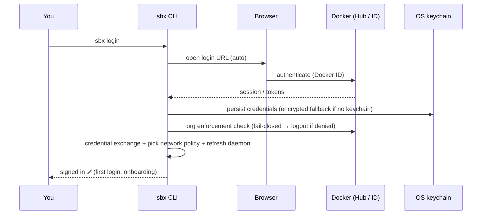

# `sbx login` — how it works and what happens

## What `sbx login` is (and is not)

`sbx login` signs **you** in to your **Docker account** (Docker ID / Docker Hub). It authenticates *the person using `sbx`* to Docker's sandboxes service — it is the last step of installation and is required before you can create sandboxes.

> ✋ **Do not confuse the two kinds of credentials:**
> - **`sbx login`** → *who you are* (your Docker ID). One time, per machine.
> - **`sbx secret set …`** → *service credentials the agent uses* (e.g. your OpenAI API key with `sbx secret set -g openai`, or a GitHub token). These are stored separately and injected by the proxy — see [`00-02.sbx-introduction.md`](./00-02.sbx-introduction.md).
>
> Signing in to Docker does **not** give the agent an OpenAI key, and setting the OpenAI secret does **not** sign you in to Docker. You need both.

## What happens when you run it

```bash
sbx login
```

1. **Browser-based Docker sign-in.** `sbx` prints a login URL and **auto-opens it in your default browser**. You authenticate as your Docker ID there (the CLI waits for the browser flow to complete).
2. **Credentials are persisted locally.** On success the session is stored in your **OS keychain**. If the keychain is unavailable, `sbx` falls back to an **encrypted on-disk store** and warns you.
3. **Organization enforcement check (fail-closed).** If your organization enforces a list of allowed orgs, `sbx` verifies your membership against Docker Hub. If you are **not** in an allowed org — or the check errors out — you are **immediately logged out** and access is denied. No enforcement configured → this step is skipped.
4. **Credential exchange.** Right after login (when the refresh token is freshest), `sbx` captures/exchanges the Docker account credential so cloud-backed features (e.g. cloud builds, cloud MCP) are authenticated. This never revokes your local session on its own.
5. **Network policy selection & daemon refresh.** `sbx login` prompts you to **select a network policy**, then does a best-effort **policy refresh** of the already-running daemon so the new credentials and policy take effect immediately, without waiting for the next polling cycle.
6. **First-login onboarding.** On your very first successful login, `sbx` records a persistent first-login marker and may offer a short onboarding flow. This runs only once.



## Related commands

- **`sbx logout`** — revokes the Docker session, wipes any automation credentials, and stops the local daemon, leaving a clean state.
- **`sbx login --username <user> --password-stdin`** — non-interactive sign-in (e.g. CI), reading the token from stdin instead of the browser flow.

## Where this fits in the workshop

You run `sbx login` **once** during setup ([`00-00.requirements.md`](./00-00.requirements.md)). After that, authenticate the Codex agent with your OpenAI key (`sbx secret set -g openai`) and you are ready to create sandboxes with `sbx run codex`.

> 📖 Official docs: <https://docs.docker.com/ai/sandboxes/#get-started>
