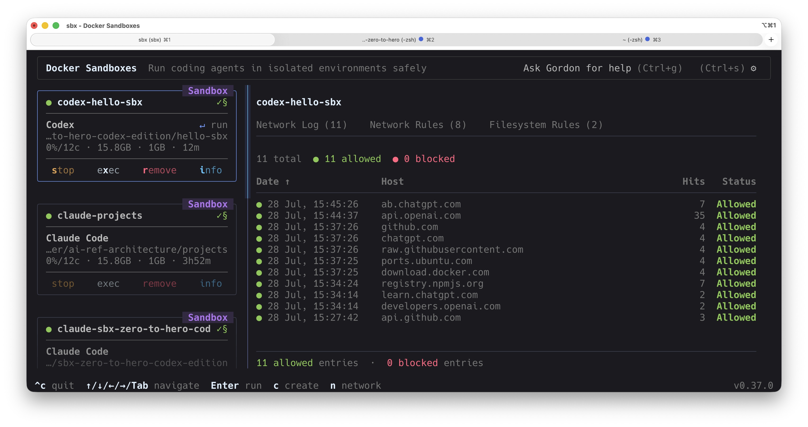
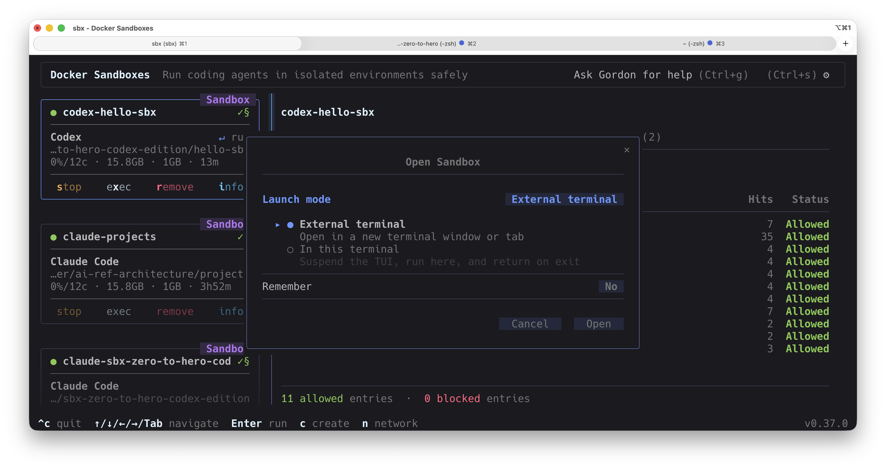
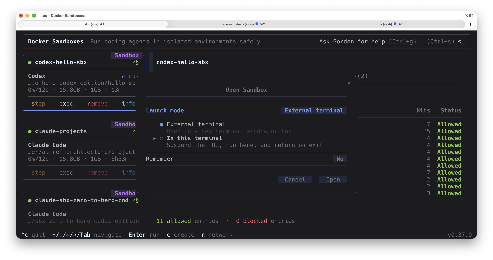
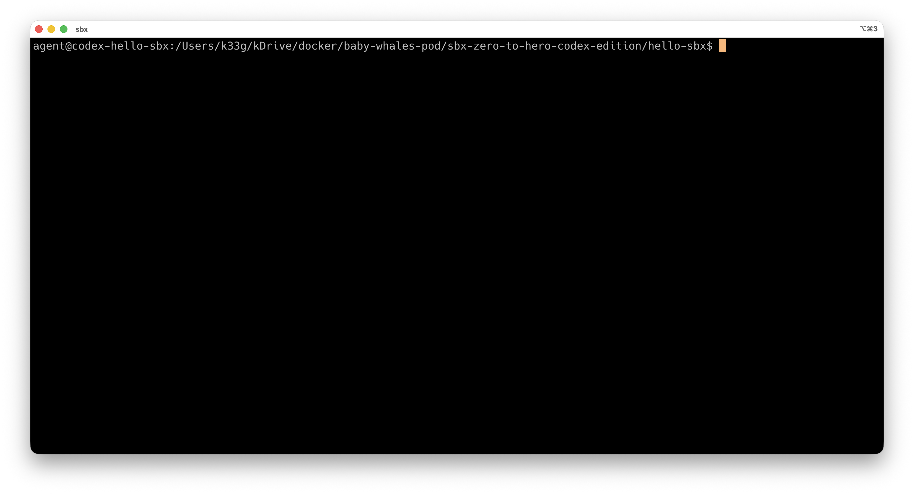
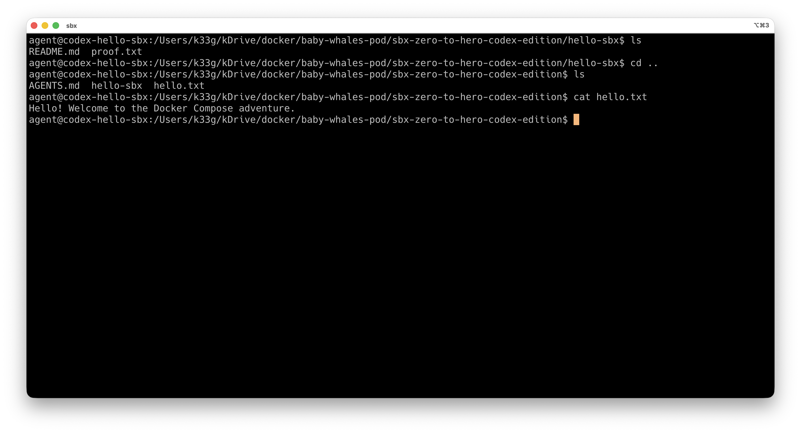

# Walk (and play) into the sandbox
> `sbx` without ai governance policy

> [!NOTE]
> In this lesson you will drive the Codex agent to create a few files, then explore the sandbox's own shell and filesystem to see first-hand what is — and what is not — shared with your host.

- show me the content of the repository
- create a README.md file with a story about docker compose
- run `cd ..` then create a `hello.txt` file with a greeting message
- show me the content of the `hello.txt` file

## Now check your **host** — where did the files go?

On your host machine, look at the `hello-sbx` folder and its parent:

```bash
# in your hello-sbx repo → the README.md the agent wrote IS here
ls hello-sbx/

# in the parent folder → there is NO hello.txt
ls ..
```

The `README.md` shows up on the host, but the `hello.txt` **does not** — even though the agent clearly created it. Why?

Because **only the workspace you mounted (`hello-sbx`) is shared** with the host, as a live bind-mount: anything the agent writes *inside* the workspace appears on the host immediately (that is the `README.md`). But when the agent ran `cd ..` and wrote `hello.txt`, it wrote it to the **parent directory that lives inside the sandbox's own isolated filesystem** — a path that was never mounted to your host. So `hello.txt` exists only inside the VM; from the host it simply isn't there.

That is the whole point of the sandbox: the agent can roam and write outside your project, but everything outside the mounted workspace stays trapped in the disposable VM and never touches your machine.

## Open the `sbx` dashboard

Open a **new** terminal, then type

```bash
sbx
```

You should see your `sbx` sandbox, named `codex-hello-sbx`



Select your sandbox ans click on **`exec`**.



Select **`In this terminal`**.



**You are now in the shell (and filesystem) of the VM**




Try the follwing commands:

```bash
uname
uname -a
ls
cd ..
ls
cat hello.txt
```

Then type `exit` to go back to the `sbx` dashboard


