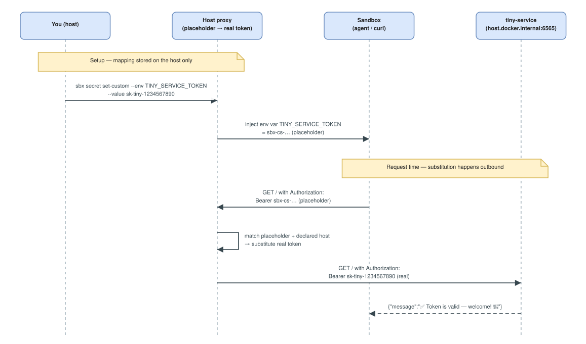

# Secrets injection
> `sbx` without ai governance policy

> [!NOTE]
> In this lesson you will run a small local service that checks a token, then use a **custom secret** so the Codex agent can authenticate to it — while only ever seeing a placeholder, never the real token.

## Why custom secrets?

`sbx` ships built-in credential types for known services (OpenAI, GitHub…). A **custom secret** extends the same protection to *any* service `sbx` doesn't know about: the sandbox only ever sees a random placeholder (a `sbx-cs-…` sentinel), while the host proxy substitutes the real value into outbound requests to the host(s) you declare. So the agent can call a private/internal API with a valid token it can **never read** — even if it dumps its environment or is tricked into exfiltrating, all it leaks is the useless placeholder. (Contrast with [`03-01`](./03-01.env-vars-injection.md): plain env vars are readable config; secrets stay invisible.)

Here we demo it against **`tiny-service`**, a tiny local HTTP service that only accepts requests carrying the token `sk-tiny-1234567890`.

### How the placeholder works

At **setup time**, `sbx secret set-custom` stores the mapping *placeholder → real token* **only on the host** (scoped to the `--host` targets you declared) and sets the sandbox env var `TINY_SERVICE_TOKEN` to the placeholder. At **request time**, the sandbox sends the placeholder in the header; the host proxy — the only place that knows the real value — swaps it in on the way out, but only for requests to the declared hosts. The real token never enters the sandbox.

<!-- Mermaid source kept for reference — the rendered diagram is the
     .drawio.svg below. Arrows are written "--&gt;" so they do not
     close this HTML comment.
```mermaid
sequenceDiagram
    participant U as You (host)
    participant P as Host proxy<br/>(placeholder → real token)
    participant S as Sandbox<br/>(agent / curl)
    participant T as tiny-service<br/>(host.docker.internal:6565)

    Note over U,P: Setup — mapping stored on the host only
    U->>P: sbx secret set-custom --env TINY_SERVICE_TOKEN --value sk-tiny-1234567890
    P->>S: inject env var TINY_SERVICE_TOKEN = sbx-cs-… (placeholder)

    Note over S,T: Request time — substitution happens outbound
    S->>P: GET / with Authorization: Bearer sbx-cs-… (placeholder)
    P->>P: match placeholder + declared host → substitute real token
    P->>T: GET / with Authorization: Bearer sk-tiny-1234567890 (real)
    T--&gt;>S: {"message":"✅ Token is valid — welcome! 🎉"}
```
-->



> 🖉 Editable source: [`.assets/03-02-sbx-secrets-injection.drawio.svg`](./.assets/03-02-sbx-secrets-injection.drawio.svg) — open at <https://app.diagrams.net>.

> If the agent dumps its environment or is tricked into exfiltrating `TINY_SERVICE_TOKEN`, all it leaks is the useless `sbx-cs-…` placeholder — and the proxy only substitutes for the hosts you declared, so the placeholder is worthless anywhere else.

## Secret injection (custom credential)

We are going to run our Go **`tiny-service`** inside its own sandbox — but this one uses the **`shell`** template instead of an AI agent. The `shell` template is an **agent-less** sandbox: it boots the same isolated VM with a plain Bash login shell and no agent running commands for you. It is the go-to choice for hosting a plain process (like our test service), doing manual setup, or inspecting an environment. See the official docs: <https://docs.docker.com/ai/sandboxes/agents/shell/>.

So below we create a `shell` sandbox over the `tiny-service` folder, publish its port, and start the Go service inside it with `./start.sh`.

> [!TIP]
> No need to install anything: **Go is already baked into the base sandbox image** (along with Node, Python, Java…), so `start.sh` can run `go build` straight away inside the `shell` sandbox.

In another terminal

```bash
cd tiny-service
# create a shell sandbox
sbx create --name tiny-service shell .
# publish the 6565 port to the host
sbx ports tiny-service --publish 6565:6565/tcp
# start the service
sbx exec -d tiny-service bash -lc "./start.sh"
```

> If you are on Windows and it does not work, try this:
> ```powershell
> sbx exec -d tiny-service bash -lc "sed -i 's/\r$//' start.sh"
> sbx exec -d tiny-service bash -lc "chmod +x start.sh"
> sbx exec -d tiny-service bash -lc "./start.sh"
> ```

> If you type `sbx` in a terminal, you can see the `sbx` dashboard

### Test the service with curl
> 📺 Open another terminal
```bash
# good token
curl -H "x-api-key: sk-tiny-1234567890" http://localhost:6565/

# bad token
curl -H "x-api-key: oups" http://localhost:6565/

# Bearer Authorization
curl -H "Authorization: Bearer sk-tiny-1234567890" http://localhost:6565/
```

> On Windows:
> ```powershell
> # good token  
> curl.exe -H "x-api-key: sk-tiny-1234567890" http://localhost:6565/
>
> # bad token
> curl.exe -H "x-api-key: oups" http://localhost:6565/
>
> # Bearer Authorization
> curl.exe -H "Authorization: Bearer sk-tiny-1234567890" http://localhost:6565/
> ```

### Create the custom secret (first!)

```bash
sbx secret set-custom -g \
    --host localhost \
    --host host.docker.internal \
    --env TINY_SERVICE_TOKEN \
    --value sk-tiny-1234567890
```

> If you are on Windows:
> ```powershell
> sbx secret set-custom `
>   --host localhost `
>   --host host.docker.internal `
>   --env TINY_SERVICE_TOKEN `
>   --value sk-tiny-1234567890
>```

Output:

```text
Saved custom secret placeholder "sbx-cs-nnQrFvDDSODjFNB7" for target "localhost, host.docker.internal" env "TINY_SERVICE_TOKEN" in scope "(global)"
Generated placeholder: sbx-cs-nnQrFvDDSODjFNB7
You may need to update environment variable TINY_SERVICE_TOKEN inside existing sandboxes to "sbx-cs-nnQrFvDDSODjFNB7" (the placeholder value).
```

The placeholder is random — yours will differ.

> The mapping (placeholder → real value, scoped to `--host`) lives only on the host. Inside the sandbox `TINY_SERVICE_TOKEN` holds the placeholder; the proxy swaps it for the real token only on outbound requests to the declared hosts.

Type:
```bash
sbx secret ls
```


### Update the value of the placeholder (into the other sandbox)

The sandbox only ever sees the placeholder:

```bash
sbx exec codex-hello-sbx -- bash -lc \
  'echo "export TINY_SERVICE_TOKEN=sbx-cs-YghH0sq2LtM7fkkr" >> /etc/sandbox-persistent.sh'
```

> If you are on Windows, use this:
> ```powershell
> sbx --% exec -d codex-hello-sbx bash -c "echo 'export TINY_SERVICE_TOKEN=\"sbx-cs-YghH0sq2LtM7fkkr\"' >> /etc/sandbox-persistent.sh"
> ```

Open an interactive shell (to check the value of the place holder):

```bash
sbx exec -it codex-hello-sbx bash -l
echo $TINY_SERVICE_TOKEN
```

### Test the token

An outbound request through the proxy gets the real value substituted into the header (use `sh -c` so `$TINY_SERVICE_TOKEN` expands inside the container):

> Inside the same interactive shell
```bash
curl -sS -H "Authorization: Bearer $TINY_SERVICE_TOKEN" http://host.docker.internal:6565/
```

### Test the token from the interactive agent:


```text
please run: curl -sS -H "Authorization: Bearer $TINY_SERVICE_TOKEN" http://host.docker.internal:6565/
```

You should get something like this:

```log
● Bash(curl -sS -H "Authorization: Bearer $TINY_SERVICE_TOKEN"
      http://host.docker.internal:6565/)
  ⎿  {
       "message": "✅ Token is valid — welcome! 🎉",
       "status": "success"
     }

● The request succeeded:

  {"message":"✅ Token is valid — welcome! 🎉","status":"success"}

  The service on host.docker.internal:6565 accepted the bearer token from
  $TINY_SERVICE_TOKEN and returned a success response.
```

That means the agent can reach the service, but without knowing the **secret**.