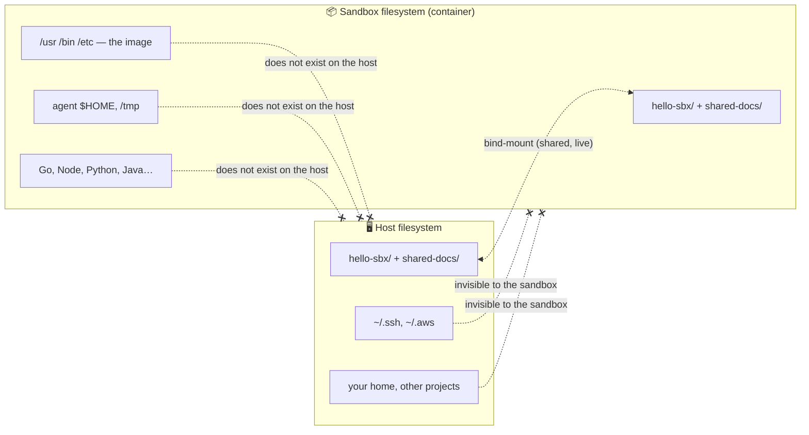

# Filesystem & workspaces
> `sbx` without ai governance policy

> [!NOTE]
> In this lesson you will mount host directories into a sandbox as workspaces — one read-write, one read-only — prove that everything you did not mount stays invisible to the agent, and check that writes to a read-only workspace are refused.

A **workspace** is a host directory mounted into the sandbox. It is the *only* part of your host filesystem the agent can see — everything else (`~/.ssh`, `~/.aws`, your home directory, …) stays invisible.

You can mount:
- **one** workspace (the default, read-write)
- **several** workspaces at once
- some of them **read-only** by appending `:ro`

> Mount spec format: `PATH` or `PATH:ro` (a read-write workspace is a live bind-mount: what the agent writes shows up on the host, and vice-versa).

## 1. Prepare a second directory on the host

From your `hello-sbx` repository:

```bash
# a folder we will mount READ-ONLY
mkdir -p ../shared-docs
echo "# Reference documentation (read-only)" > ../shared-docs/REFERENCE.md
echo "The agent can read this, but must not modify it." >> ../shared-docs/REFERENCE.md
```

## 2. Create a **new** sandbox with two workspaces

- the current directory `.` → **read-write**
- `../shared-docs` → **read-only** (note the `:ro` suffix)

```bash
sbx run codex . ../shared-docs:ro --name codex-workspaces
```


## 3. See what the agent sees

Ask the agent:

```text
- list the top-level folders you have access to
- read the file shared-docs/REFERENCE.md and summarize it
```

The agent can **read** the mounted docs.

## 4. Prove the host is isolated

Ask the agent:

```text
- try to read ~/.ssh/id_rsa on the host
- try to list the home directory of the host machine
```

The agent cannot reach anything outside the mounted workspaces — those host paths simply do not exist inside the sandbox.

### So what *does* the agent see?

The agent sees a **complete Linux filesystem** — but it is the **sandbox's own** filesystem (the container image), *not* your host's. When it lists `/`, it gets `/usr`, `/bin`, `/etc`, `/home`, `/tmp`, the pre-installed toolchains (Go, Node, Python, Java…), its own `$HOME`, and the mounted workspaces. All of that is real *inside* the sandbox and lives nowhere on your host — it is the container's isolated view. Conversely, everything on your host that you did **not** mount as a workspace (`~/.ssh`, `~/.aws`, your real home directory, your other projects…) is absent from that view.

Think of it as two separate filesystems that **overlap only at the workspaces**:



The **only** bridge between the two is the mounted workspaces: a read-write workspace is a live bind-mount, so a change on one side is instantly visible on the other. Everything else the agent sees (the OS, the tools, its home) is its own throwaway world — deleting the sandbox with `sbx rm` discards it, while your host filesystem is untouched.

## 5. Read-only is enforced

Ask the agent to modify the read-only workspace:

```text
please append a line "hacked" to shared-docs/REFERENCE.md
```

It fails with a **read-only filesystem** error.

Confirm it yourself from a terminal. `sbx exec` starts in the **primary workspace**, and the read-only one is its sibling (`../shared-docs`):

```bash
# write into the read-write workspace: OK
sbx exec codex-workspaces -- sh -c 'echo "written by the agent side" > proof.txt && echo OK'

# write into the read-only workspace: DENIED
sbx exec codex-workspaces -- sh -c 'echo nope >> ../shared-docs/REFERENCE.md'
# -> Read-only file system
```

> ✋ Workspaces are mounted **at the same absolute path as on the host** (check the WORKSPACE column of `sbx ls`), so relative paths from the primary workspace resolve exactly like on your machine.

## 6. The read-write workspace is live

Anything written to the read-write workspace appears on the host:

```bash
cat proof.txt
# -> written by the agent side
```

## 7. Cleanup (but don't do it)

```bash
rm -f proof.txt
sbx rm codex-workspaces
# if busy: sbx rm codex-workspaces -f
```

> **Next step:** read-only workspaces are the *local* way to restrict what a sandbox can touch on disk. To see how these mounts show up as **filesystem policy rules**, continue with `04-03-filesystem-policies.md`. For *full* isolation (the agent works on a private clone instead of a live bind-mount), see the `--clone` mode.
