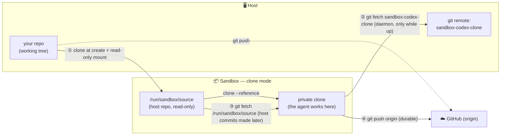

# Clone mode: an isolated copy of your repo
> `sbx` without ai governance policy

> [!NOTE]
> In this lesson you will create a sandbox in **clone mode** (`--clone`), see how the agent works on a *private in-container clone* of your repository instead of your live files, then **sync the agent's commits back to the host** — and pull host-side changes into the sandbox.

## Why clone mode?

By default a sandbox uses **direct mode**: your host working tree is **bind-mounted live** into the sandbox (see [`04-02-workspaces.md`](./04-02-workspaces.md)), so every edit and commit the agent makes appears on your host **immediately**. That is convenient, but it also means the agent is writing straight into your real files.

**Clone mode** (`--clone`) instead gives the agent a **standalone Git clone** of your repository, made when the sandbox starts. The agent experiments, edits and commits entirely inside that copy — **your host working tree is never touched**. You review the result and pull it back **only when you decide to**. Use it when you want the agent to work freely (risky refactors, throwaway experiments, untrusted tasks) without any chance of dirtying your real checkout.

| | Direct mode (default) | Clone mode (`--clone`) |
|---|---|---|
| Host files | live bind-mount — edits appear instantly | untouched — agent works on a private clone |
| Agent's commits | already on the host | stay in the sandbox until you fetch them |
| Best for | fast iteration on real files | isolation, experiments, untrusted tasks |

### What clone mode protects you from

The security payoff comes from *where the `.git` directory lives*: in clone mode it exists **only inside the sandbox**, and only Git **objects and refs** ever cross back to the host (via `git fetch`). That neutralises a whole class of attacks that direct mode leaves open:

- **Git hook injection.** In direct mode the agent writes into your live `.git/hooks/`. A malicious or manipulated task could drop a `pre-commit`, `post-checkout` or `pre-push` hook that then runs **on your host, as you**, the next time *you* touch the repo. In clone mode the clone starts with fresh default hooks, any hook the agent creates stays in the sandbox, and `git fetch sandbox-<name>` **never transfers hooks** — so a poisoned hook can't reach your machine.
- **`.git/config` poisoning.** Tricks like a command-running `alias.*`, a malicious `core.pager` / `core.editor`, `core.fsmonitor`, or an `include.path` pointing at an attacker-controlled file all live in `.git/config` — which is likewise never transferred by a fetch. Your host Git config is untouched.
- **Trashing your working tree.** No half-finished edits, force-resets, or branch/tag deletions can land on your real checkout: the agent only ever mutates its disposable copy.

You stay in control: the agent's work only becomes real when **you** deliberately `git fetch sandbox-<name>` and merge it — and you can throw the whole thing away with `sbx rm` if you don't like it.

## How it works

At **create time**, `sbx` bind-mounts your host repository **read-only** inside the sandbox at `/run/sandbox/source`, then makes a private clone from it for the agent to work in. The clone's HEAD matches whatever your host repo had checked out — and **no working branch is created for you**.

Two bridges connect the clone back to the outside world:
- **Sandbox → host:** `sbx` runs a small `git-daemon` inside the sandbox and registers a git remote named **`sandbox-<name>`** in your host repo. From the host you `git fetch sandbox-<name>` to retrieve the agent's commits. This daemon **only runs while the sandbox is up**.
- **Host → sandbox:** to pull commits your host made *after* the sandbox started, you fetch from the read-only mount `/run/sandbox/source` inside the sandbox.
- **`origin`** inside the clone points at your **upstream forge** (GitHub, …), *not* at the host repo — so `git push origin` from the sandbox is the **durable** way to save work.



## 1. Create a clone-mode sandbox

`--clone` must be set **at creation** (it is a no-op when re-attaching to an existing sandbox). We reuse the `hello-sbx` repository:

```bash
cd hello-sbx
sbx run codex . --clone --name codex-clone
```

## 2. Confirm you are in clone mode

The tell-tale sign is the read-only source mount:

```bash
sbx exec codex-clone -- bash -lc 'if [ -d /run/sandbox/source ]; then echo "clone mode"; else echo "direct mode"; fi'
# -> clone mode
```

> If you are on Windows:
> ```powershell
> sbx exec codex-clone -- bash -lc "if [ -d /run/sandbox/source ]; then echo 'clone mode'; else echo 'direct mode'; fi"
> # -> clone mode
> ```

> The check is simply: does the read-only host mount `/run/sandbox/source` exist? `[ -d PATH ]` is true when `PATH` is a directory — present only in clone mode, absent in direct mode.

## 3. The agent works on its own branch

Because no branch is created for you, start one before making changes. Ask the agent:

```text
- create a branch named agent-work
- add a file CLONE_NOTES.md containing "hello from clone mode"
- commit it with the message "docs: add clone-mode notes"
```

Or do it yourself with `sbx exec`:

```bash
sbx exec codex-clone -- bash -lc '
  git checkout -b agent-work
  echo "hello from clone mode" > CLONE_NOTES.md
  git add CLONE_NOTES.md
  git commit -m "docs: add clone-mode notes"
'
```

Now check your **host** working tree — the change is **not** there, because it lives only inside the sandbox's clone:

```bash
ls CLONE_NOTES.md
# -> No such file or directory
git status
# -> nothing to commit, working tree clean
```

## 4. Sync the agent's commits back to the host

`sbx` already added a remote named `sandbox-codex-clone` to your host repo (`<name>` = the sandbox name, also exposed inside the sandbox as `$SANDBOX_VM_ID`). Fetch the agent's branch and bring it in:

```bash
git remote -v | grep sandbox-codex-clone      # the remote sbx created for you
# on Windows: git remote -v | Select-String "sandbox-codex-clone"
git fetch sandbox-codex-clone
git log --oneline sandbox-codex-clone/agent-work

# adopt the agent's branch locally
git checkout agent-work
# (or, to bring it into your current branch: git merge sandbox-codex-clone/agent-work)
```

> [!IMPORTANT]
> The `sandbox-codex-clone` remote is served by a `git-daemon` that **only runs while the sandbox is up**. If `git fetch sandbox-codex-clone` fails, make sure the sandbox is running (`sbx ls`; `sbx exec codex-clone -- true` starts it if stopped).

## 5. Pull host changes made after creation

Suppose you commit something on the **host** *after* the sandbox was created:

```bash
echo "made on the host" > HOST_NOTES.md
git add HOST_NOTES.md
git commit -m "docs: host-side change"
```

Inside the sandbox, `origin` points at GitHub (not your host), so to see that **local** host commit you fetch from the read-only source mount:

```bash
sbx exec codex-clone -- bash -lc '
  git fetch /run/sandbox/source
  git log --oneline HEAD..FETCH_HEAD      # commits on the host you do not have yet
  git merge FETCH_HEAD                    # or: git pull /run/sandbox/source <branch>
'
```
> 👋 or ask the agent to do it for you

## 6. The durable path — push to GitHub

Commits that live **only** inside the sandbox are **lost when the sandbox is removed** (the daemon dies with it). To save the agent's work for good, push it to the forge from inside the sandbox — `origin` already points at your GitHub repo:

```bash
sbx exec codex-clone -- bash -lc 'git push -u origin agent-work'
```

## 7. Cleanup

```bash
# remove the sandbox (its in-container commits go with it — push first if you need them)
sbx rm codex-clone

# drop the now-dead remote from your host repo
git remote remove sandbox-codex-clone
```

> **In short:** clone mode = a disposable, isolated copy your agent can't use to dirty your real checkout. Pull work back with `git fetch sandbox-<name>` on the host, push to GitHub for anything you want to keep, and remember that un-fetched, un-pushed commits vanish with `sbx rm`.
