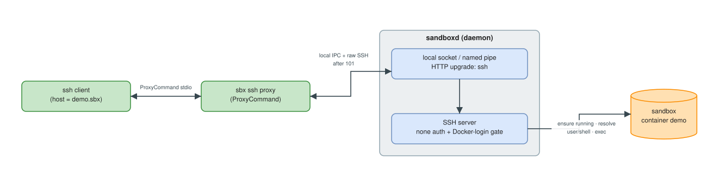

# SSH into a sandbox — one host, every SSH-native tool
> `sbx` without ai governance policy

<!--
> [!WARNING]
> 🛑 **This lesson is not active yet.** SSH access is an **experimental** feature, off by default, and it ships in a **newer `sbx` build than the one this workshop was validated on** (v0.37.0). It is **not usable** as-is on that release: `sbx ssh` is hidden and the daemon endpoint is gated behind a feature flag. The lesson is published as a preview and becomes active once the feature reaches a public release. See the version note in the [README](./README.md).
--> 

> [!NOTE]
> In this lesson you will turn a sandbox into a first-class **SSH host** (`ssh demo.sbx`), run interactive shells and one-shot commands through it, and — the real payoff — open the sandbox directly in **VS Code / Cursor Remote-SSH**, all without installing anything inside the container.

> [!IMPORTANT]
> SSH is experimental and disabled by default. If `sbx ssh` reports *"command not found"* or the endpoint is disabled, your `sbx` predates or has not enabled this feature — see [step 1](#1-enable-the-ssh-endpoint-experimental).

## Why SSH — and why it's different here

The whole feature is one idea: **a sandbox is a host**. Once that is true, everything that already speaks SSH comes along for free — an interactive shell, one-shot commands, SFTP, and remote-development tools like VS Code, Cursor, and JetBrains Gateway — with **zero per-tool integration**.

```bash
sbx setup ssh                    # one time: configures your SSH client
ssh demo.sbx                     # an interactive shell in sandbox "demo"
ssh demo.sbx -- go test ./...    # run one command; its exit code is propagated
ssh root@demo.sbx                # the SSH username selects the in-sandbox user
```

What makes this different from a typical cloud dev environment: there is **no `sshd` inside the container**. The SSH server lives in the `sandboxd` **daemon**, which then bridges you into the container using the same exec mechanism `sbx exec` already uses. Two consequences follow:

- **It works on any image** — even minimal or distroless ones — because the container doesn't need to contain anything for SSH to reach it.
- **The sandbox name is the hostname.** `demo.sbx` is sandbox `demo`; the `.sbx` suffix is just a namespace so these names never collide with your real hosts. You never memorize ports or IPs.

<!-- Mermaid source kept for reference — the rendered diagram is the
     .drawio.svg below. Arrows are written "--&gt;" so they do not
     close this HTML comment.
```mermaid
flowchart LR
    cli["ssh client<br/>(host = demo.sbx)"]
    proxy["sbx ssh proxy<br/>(ProxyCommand)"]
    subgraph d["sandboxd (daemon)"]
      api["local socket / named pipe<br/>HTTP upgrade: ssh"]
      sshsrv["SSH server<br/>none auth + Docker-login gate"]
    end
    ctr[("sandbox<br/>container demo")]
    cli <--&gt;|"ProxyCommand stdio"| proxy
    proxy <--&gt;|"local IPC + raw SSH after 101"| api
    api --&gt; sshsrv
    sshsrv --&gt;|"ensure running · resolve user/shell · exec"| ctr
```
-->



> 🖉 Editable source: [`.assets/08-01-sbx-ssh-access.drawio.svg`](./.assets/08-01-sbx-ssh-access.drawio.svg) — open at <https://app.diagrams.net>.

There is **no `sbx ssh connect` verb**: `sbx` only *provisions your client*. `sbx setup ssh` writes a single wildcard `Host *.sbx` block into `~/.ssh/config` whose `ProxyCommand` (`sbx ssh proxy`) dials the daemon's local socket and performs an HTTP upgrade to a raw SSH stream. Authentication is handled at the daemon socket (OS-user boundary) plus an active Docker login — **no SSH client key is needed or accepted**.

## 1. Enable the SSH endpoint (experimental)

The endpoint is gated behind an experimental feature flag, read at daemon startup:

```bash
sbx settings set platform.allowExperimentalFeatures true
sbx settings set feature.ssh true
sbx daemon stop
sbx daemon start -d
```

> If `sbx ssh` errors while the flag is off, it prints the exact steps above — the command is deliberately hidden until the feature is enabled.

## 2. Set up your SSH client (once)

One idempotent command writes the managed `Host *.sbx` block and the host-key verification state into `~/.ssh/config`:

```bash
sbx setup ssh            # re-run any time; safe to repeat
```

It configures your client not to offer keys or an agent, and installs a `KnownHostsCommand` that re-checks the daemon's **current** host key on every connect (so rotating the key never triggers a false "host key changed" failure).

## 3. Connect to an existing sandbox

The workspace is a **creation-time** decision — it is not conveyed over SSH. So the cleanest path is: create a sandbox for your project the normal way, then attach to it over SSH. We reuse the `hello-sbx` repository from the earlier modules:

```bash
cd hello-sbx
sbx run codex . --name codex-ssh      # create it the normal way (this sets the workspace)
```

Now reach it as a host:

```bash
ssh codex-ssh.sbx                     # interactive shell inside the sandbox
ssh codex-ssh.sbx -- ls -la           # one-shot command
ssh codex-ssh.sbx -- 'echo hi; exit 7'; echo "exit=$?"   # -> exit=7 (exit code propagates)
ssh root@codex-ssh.sbx                # connect as root in the sandbox
```

> A bare `ssh codex-ssh.sbx` runs as the image's default user; put a username in front (`root@…`) to pick a different in-sandbox user. An unknown user is rejected ("user … not found"), never silently downgraded.

## 4. Open the sandbox in VS Code / Cursor (the payoff)

Because the sandbox is now an ordinary entry in `~/.ssh/config`, any SSH-native editor finds it — **no extension config, no tunnel to set up**.

1. In VS Code (with the **Remote - SSH** extension) or **Cursor**, run **"Connect to Host…"** from the command palette.
2. Pick **`codex-ssh.sbx`** from the list (it's there because the editor reads the same `~/.ssh/config` you just configured).
   Or type `ssh codex-ssh.sbx`
3. The editor opens a remote window **inside the sandbox**: the file explorer, integrated terminal, and extensions all run in the container.
4. You can start `codex` from the terminal.

This works because the editor copies its remote server into the sandbox over **SFTP** (supported by the endpoint) and then runs it there — the same reason the Codex / Claude desktop apps work over this endpoint.

> **JetBrains Gateway** and any other Remote-SSH client work the same way: address the host as `codex-ssh.sbx`.

## 6. Cleanup

```bash
sbx rm codex-ssh                 # (and: sbx rm fresh-demo if you auto-created one)
```

The managed `Host *.sbx` block stays in `~/.ssh/config` for future sandboxes — that's the point of the ambient, one-time setup. Remove it by editing `~/.ssh/config` only if you want to stop using the feature entirely.

> **In short:** `sbx setup ssh` makes every sandbox an SSH host reachable by name (`<name>.sbx`) — no `sshd`, no per-tool integration. You get shells, one-shot commands with real exit codes, SFTP, and full VS Code / Cursor Remote-SSH into the container, with auth handled by the local daemon socket plus your Docker login.

## References

- [Docker SBX and SSH](https://docs.docker.com/reference/cli/sbx/setup/ssh/)
- Docker Sandboxes overview & usage: <https://docs.docker.com/ai/sandboxes/>, <https://docs.docker.com/ai/sandboxes/usage/>
- Publishing ports to the host (the non-SSH way to expose a service): <https://docs.docker.com/reference/cli/sbx/ports/>
- VS Code Remote - SSH (host-side client this lesson relies on): <https://code.visualstudio.com/docs/remote/ssh>
